# KFS Smart HRMS PostgreSQL Database Design

Kenya Forest Service HR & Payroll Management System (KFS Smart HRMS) uses a normalized PostgreSQL schema with 98 tables. Every table includes `id`, `uuid`, `created_by`, `updated_by`, `deleted_by`, `created_at`, `updated_at`, and `deleted_at`.

`id` is the internal PostgreSQL-optimized primary key. `uuid` is the stable public identifier for APIs, URLs, imports, exports, audit trails, and integrations.

## ER Diagram

```mermaid
erDiagram
    USERS ||--o| USER_PROFILES : owns
    USERS ||--o{ NOTIFICATIONS : receives
    USERS ||--o{ REPORT_RUNS : starts
    USERS ||--o{ AUDIT_LOGS : creates

    ROLES ||--o{ MODEL_HAS_ROLES : assigned
    PERMISSIONS ||--o{ MODEL_HAS_PERMISSIONS : assigned
    ROLES ||--o{ ROLE_HAS_PERMISSIONS : grants
    PERMISSIONS ||--o{ ROLE_HAS_PERMISSIONS : included

    DEPARTMENTS ||--o{ DEPARTMENTS : parent
    STATIONS ||--o{ STATIONS : parent
    STATIONS ||--o{ STATION_DEPARTMENTS : maps
    DEPARTMENTS ||--o{ STATION_DEPARTMENTS : maps
    JOB_GRADES ||--o{ JOB_POSITIONS : grades
    JOB_POSITIONS ||--o{ POSITION_ESTABLISHMENTS : budgeted
    STATIONS ||--o{ COST_CENTRES : funds

    USERS ||--o| EMPLOYEES : login
    EMPLOYEES ||--o{ EMPLOYEE_IDENTIFICATIONS : has
    EMPLOYEES ||--o{ EMPLOYEE_CONTACTS : has
    EMPLOYEES ||--o{ EMPLOYEE_ADDRESSES : has
    EMPLOYEES ||--o{ EMPLOYEE_DEPENDANTS : has
    EMPLOYEES ||--o{ EMPLOYEE_BANK_ACCOUNTS : paid_to
    EMPLOYEES ||--o{ EMPLOYEE_DOCUMENTS : stores
    EMPLOYEES ||--o{ EMPLOYEE_MOVEMENTS : changes
    EMPLOYEES ||--o| EMPLOYEE_EXIT_RECORDS : exits

    EMPLOYEES ||--o{ CONTRACTS : employed_under
    EMPLOYMENT_TYPES ||--o{ CONTRACTS : classifies
    CONTRACT_TYPES ||--o{ CONTRACTS : defines
    CONTRACTS ||--o{ CONTRACT_RENEWALS : renewed_by
    CONTRACTS ||--o{ PROBATION_RECORDS : evaluated_by
    EMPLOYEES ||--o{ DEPLOYMENTS : assigned_to
    EMPLOYEES ||--o{ PROMOTIONS : promoted_by

    PAYROLL_PERIODS ||--o{ PAYROLL_RUNS : processed_in
    PAY_GROUPS ||--o{ PAYROLL_RUNS : processed_for
    PAYROLL_RUNS ||--o{ PAYROLL_RUN_ITEMS : contains
    PAYROLL_RUNS ||--o{ PAYSLIPS : publishes
    EMPLOYEES ||--o{ PAYROLL_RUN_ITEMS : paid
    PAY_CODES ||--o{ PAYROLL_RUN_ITEMS : calculates
    SALARY_SCALES ||--o{ SALARY_SCALE_STEPS : has
    SALARY_SCALE_STEPS ||--o{ EMPLOYEE_SALARY_ASSIGNMENTS : assigned
    STATUTORY_DEDUCTIONS ||--o{ TAX_BANDS : configures
    PENSION_SCHEMES ||--o{ EMPLOYEE_PENSION_MEMBERSHIPS : enrolls

    LEAVE_TYPES ||--o{ LEAVE_POLICIES : governed_by
    LEAVE_POLICIES ||--o{ LEAVE_POLICY_RULES : contains
    EMPLOYEES ||--o{ LEAVE_BALANCES : accrues
    EMPLOYEES ||--o{ LEAVE_REQUESTS : submits
    LEAVE_REQUESTS ||--o{ LEAVE_REQUEST_DAYS : expands_to
    LEAVE_REQUESTS ||--o{ LEAVE_APPROVALS : approved_by
    HOLIDAY_CALENDARS ||--o{ HOLIDAYS : contains

    SHIFTS ||--o{ EMPLOYEE_SHIFT_ASSIGNMENTS : assigned
    SHIFT_PATTERNS ||--o{ EMPLOYEE_SHIFT_ASSIGNMENTS : schedules
    ATTENDANCE_DEVICES ||--o{ ATTENDANCE_LOGS : captures
    EMPLOYEES ||--o{ ATTENDANCE_RECORDS : summarized
    ATTENDANCE_RECORDS ||--o{ ATTENDANCE_EXCEPTIONS : flags
    EMPLOYEES ||--o{ OVERTIME_REQUESTS : requests
    EMPLOYEES ||--o{ TIMESHEETS : submits

    APPRAISAL_CYCLES ||--o{ APPRAISAL_FORMS : configures
    APPRAISAL_CYCLES ||--o{ APPRAISAL_GOALS : includes
    EMPLOYEES ||--o{ APPRAISAL_REVIEWS : reviewed
    APPRAISAL_REVIEWS ||--o{ APPRAISAL_SCORES : scored_by
    EMPLOYEES ||--o{ PERFORMANCE_IMPROVEMENT_PLANS : assigned
    EMPLOYEES ||--o{ DISCIPLINARY_CASES : subject_of

    TRAINING_CATEGORIES ||--o{ TRAINING_COURSES : groups
    TRAINING_COURSES ||--o{ TRAINING_SESSIONS : schedules
    TRAINING_SESSIONS ||--o{ TRAINING_ENROLLMENTS : enrolls
    TRAINING_ENROLLMENTS ||--o| TRAINING_FEEDBACK : receives

    ESS_REQUESTS ||--o{ ESS_REQUEST_APPROVALS : approved_by
    SETTING_GROUPS ||--o{ SYSTEM_SETTINGS : groups
    NOTIFICATION_TEMPLATES ||--o{ NOTIFICATIONS : renders
    ATTACHMENT_TYPES ||--o{ ATTACHMENTS : validates
    REPORT_CATALOGS ||--o{ REPORT_RUNS : executes
```

## Global Rules

- All lookups and workflow states are configurable through settings, policies, or reference tables.
- Application code should use UUIDs externally and integer IDs internally.
- Soft-deleted records must be excluded from operational workflows but retained for audit, payroll history, and legal retention.
- Foreign keys use `nullOnDelete` for auditability; domain services must prevent deleting records that are still operationally active.
- Payroll calculations must snapshot rules into payroll run items to preserve historical payslips after configuration changes.
- Approval workflows are stored as normalized request/approval rows so they can support multi-level delegation and station-specific routing.
- JSONB is used only for configurable schemas, calculation snapshots, rule payloads, and external integration payloads.

## Logical Table Catalog

### Identity, Users, Roles, Permissions

| Table | Purpose | Relationships | Business rules |
|---|---|---|---|
| `users` | Authenticated system principals. | One profile; many sessions, notifications, audits. | Email is unique; status controls access; user records are soft-deleted only after all active assignments are resolved. |
| `user_profiles` | User preferences and employee link. | Belongs to user and optionally employee. | One profile per user and one login per employee. |
| `password_reset_tokens` | Password reset lifecycle. | Belongs to user. | Tokens expire and cannot be reused. |
| `sessions` | Laravel session persistence. | Belongs to user when authenticated. | Session key is unique; old sessions are pruned by configured retention. |
| `roles` | Spatie role catalog. | Many permissions; many users/models. | System roles cannot be removed through normal UI. |
| `permissions` | Spatie permission catalog. | Assigned directly or through roles. | Permission names follow `module.action`. |
| `model_has_roles` | Role assignment pivot with optional station scope. | Role to user/model and station. | Same model cannot receive the same role twice in the same scope. |
| `model_has_permissions` | Direct permission assignment pivot. | Permission to user/model. | Used for exceptions; roles are preferred. |
| `role_has_permissions` | Role-permission pivot. | Role to permission. | Unique pair prevents duplicate grants. |

### Organization, Departments, Stations

| Table | Purpose | Relationships | Business rules |
|---|---|---|---|
| `departments` | HR organizational units, including directorates, divisions, and sections through `parent_id` and `type`. | Self-parent; has station mappings, establishments, and employees. | Department code is unique; inactive departments cannot receive new employees. |
| `stations` | KFS operating locations. | Self-parent; has employees, devices, cost centres. | Station code is unique; region and county drive reporting filters. |
| `station_departments` | Department availability within stations. | Station to department and optional head employee. | Effective dates prevent duplicate active mappings. |
| `job_grades` | Job grade hierarchy. | Has positions and salary scales. | Rank order defines promotion direction and reporting order. |
| `job_positions` | Position titles approved by HR. | Belongs to grade; used by employees and establishments. | Inactive positions cannot be assigned. |
| `position_establishments` | Approved versus filled posts. | Station, department, position. | Filled posts must not exceed approved posts. |
| `cost_centres` | Payroll and finance allocation units. | Belongs to station; used by payroll journals. | Code maps to finance system accounts. |

### Employee Register

| Table | Purpose | Relationships | Business rules |
|---|---|---|---|
| `employees` | Master employee register. | Links user, station, department, position, and all HR records. | Employee number is unique; active employees require valid deployment and contract. |
| `employee_identifications` | National ID, KRA PIN, passport, service IDs. | Belongs to employee. | ID type and number are unique. |
| `employee_contacts` | Phone, email, and other contact channels. | Belongs to employee. | Only one primary contact per type should be active. |
| `employee_addresses` | Residential and postal addresses. | Belongs to employee. | Current address is derived from latest active address type. |
| `employee_dependants` | Dependants and beneficiaries. | Belongs to employee. | Beneficiary changes require audit trail. |
| `employee_emergency_contacts` | Emergency contact persons. | Belongs to employee. | At least one emergency contact is required before confirmation. |
| `employee_education` | Academic qualifications. | Belongs to employee. | Completion date must not precede start date. |
| `employee_professional_qualifications` | Professional memberships and certifications. | Belongs to employee. | Expired certifications cannot satisfy mandatory requirements. |
| `employee_work_experience` | Prior employment history. | Belongs to employee. | Overlaps are allowed but flagged for review. |
| `employee_bank_accounts` | Payroll bank accounts. | Belongs to employee. | One primary active account is required before payroll inclusion. |
| `employee_documents` | Employee-specific document metadata. | Belongs to employee. | Expiring documents trigger notifications. |
| `employee_assets` | Assigned KFS assets. | Belongs to employee. | Asset tag is unique; exits require returned or waived assets. |
| `employee_movements` | Transfers and department/station changes. | Employee to old/new station and department. | Movement effective date updates primary assignment through service transaction. |
| `employee_exit_records` | Resignation, retirement, dismissal, death records. | Belongs to employee. | Exit cannot be completed until clearance is complete. |

### Contracts and Deployments

| Table | Purpose | Relationships | Business rules |
|---|---|---|---|
| `employment_types` | Permanent, contract, casual, internship categories. | Used by contracts. | Pensionability is configurable. |
| `contract_types` | Contract templates and duration rules. | Used by contracts. | Types requiring end date must enforce one. |
| `contracts` | Employee employment contracts. | Employee, employment type, contract type. | Only one active contract per employee at a time. |
| `contract_renewals` | Renewal history. | Belongs to contract. | New end date must be later than previous end date. |
| `probation_records` | Probation period and confirmation decision. | Belongs to contract. | Confirmation requires approved probation record. |
| `deployments` | Employee operational assignments. | Employee, station, department, position. | One primary active deployment per employee. |
| `promotions` | Grade and position progression. | Employee plus old/new grade and position. | Promotion must move to a higher grade unless configured as lateral reclassification. |

### Payroll

| Table | Purpose | Relationships | Business rules |
|---|---|---|---|
| `payroll_periods` | Monthly or configured pay periods. | Has payroll runs and adjustments. | Closed periods cannot be recalculated without reversal. |
| `pay_groups` | Payroll population grouping. | Used by salary assignments and runs. | Employee belongs to one active pay group. |
| `pay_codes` | Earnings, deductions, benefits, employer costs. | Used in payroll items and adjustments. | Calculation rules are versioned through JSONB snapshots. |
| `salary_scales` | Salary structure per grade. | Belongs to grade; has steps. | Effective dates cannot overlap per grade. |
| `salary_scale_steps` | Salary bands/steps. | Belongs to salary scale. | Step number is unique per scale. |
| `employee_salary_assignments` | Employee salary step and pay group. | Employee, salary step, pay group. | One active assignment per employee. |
| `payroll_runs` | Payroll processing batch. | Period, pay group, run items, payslips, journals. | Run number is unique; approved runs are immutable. |
| `payroll_run_items` | Employee-level payroll lines. | Run, employee, pay code. | Amounts are stored with calculation snapshot. |
| `employee_payroll_items` | Recurring or dated payroll inputs. | Employee and pay code. | Effective dates determine run eligibility. |
| `statutory_deductions` | Configurable PAYE, NSSF, SHIF and similar deductions. | Has tax bands or rule payload. | Never hardcode statutory rules in services. |
| `tax_bands` | Graduated deduction/tax bands. | Belongs to statutory deduction. | Bands must not overlap for the same effective period. |
| `pension_schemes` | Pension scheme setup. | Has employee memberships. | Rates and caps are configurable. |
| `employee_pension_memberships` | Employee enrollment in schemes. | Employee and pension scheme. | Member number is unique within scheme. |
| `payslips` | Published payslip summary and file reference. | Payroll run and employee. | Generated only from approved payroll runs. |
| `payroll_adjustments` | One-off payroll changes. | Employee, period, pay code. | Must be approved before inclusion in run. |
| `payroll_journals` | Finance journal outputs. | Payroll run and cost centre. | Debits and credits must balance per run. |

### Leave

| Table | Purpose | Relationships | Business rules |
|---|---|---|---|
| `leave_types` | Leave categories. | Has policies, balances, requests. | Paid and attachment rules are configurable. |
| `leave_policies` | Effective leave rules. | Belongs to leave type; has rules. | Only one active policy per leave type and date range. |
| `leave_policy_rules` | Rule key/value catalog. | Belongs to leave policy. | Rule keys are unique within policy. |
| `leave_balances` | Employee annual leave balances. | Employee and leave type. | One balance per employee, leave type, and year. |
| `leave_requests` | Employee leave applications. | Employee, leave type, days, approvals. | Approved request deducts balance in a transaction. |
| `leave_request_days` | Day-level leave expansion. | Belongs to leave request. | Holidays and weekends are marked before approval. |
| `leave_approvals` | Approval trail. | Leave request and approver user. | Approvals follow configured levels. |
| `holiday_calendars` | Public holiday calendar definitions. | Has holidays. | Calendar is selected by organization or station setting. |
| `holidays` | Holiday dates. | Belongs to calendar. | Duplicate holiday names on same date are prevented. |

### Attendance

| Table | Purpose | Relationships | Business rules |
|---|---|---|---|
| `shifts` | Work shift definitions. | Used in shift assignments. | Shift times and grace minutes are configurable. |
| `shift_patterns` | Weekly/rotational shift patterns. | Used in shift assignments. | Pattern rules are JSONB to support rotations. |
| `employee_shift_assignments` | Employee schedule assignments. | Employee, shift, pattern. | Effective dates must not overlap. |
| `attendance_devices` | Biometric or clock devices. | Belongs to station; has logs. | Inactive devices cannot submit new logs. |
| `attendance_logs` | Raw attendance punches. | Device and employee. | Source reference is unique per device. |
| `attendance_records` | Daily attendance summary. | Belongs to employee; has exceptions. | One record per employee per date. |
| `attendance_exceptions` | Late, absent, missing punch issues. | Belongs to attendance record. | Open exceptions block attendance finalization. |
| `overtime_requests` | Overtime claims. | Belongs to employee. | Approved overtime can feed payroll. |
| `timesheets` | Periodic time summaries. | Belongs to employee. | Submitted timesheets require supervisor approval. |

### Performance

| Table | Purpose | Relationships | Business rules |
|---|---|---|---|
| `appraisal_cycles` | Performance cycle calendar. | Has forms, goals, reviews. | Closed cycles are read-only. |
| `appraisal_forms` | Configurable appraisal templates. | Belongs to cycle. | Form schema is versioned by cycle. |
| `appraisal_goals` | Employee goals and KPIs. | Employee and cycle. | Goal weights should total configured maximum. |
| `appraisal_reviews` | Review instance per employee/stage. | Employee, cycle, reviewer. | Final score is derived from approved scores. |
| `appraisal_scores` | Goal-level scoring. | Review and goal. | Scores must fall inside configured scale. |
| `performance_improvement_plans` | PIP actions and monitoring. | Employee and appraisal review. | Active PIPs require periodic review. |
| `disciplinary_cases` | Disciplinary case register. | Belongs to employee. | Case number is unique and status-driven. |

### Training

| Table | Purpose | Relationships | Business rules |
|---|---|---|---|
| `training_categories` | Training catalog grouping. | Has courses. | Inactive categories hide new course creation. |
| `training_courses` | Course catalog. | Category; has sessions. | Mandatory courses drive compliance reports. |
| `training_sessions` | Scheduled course delivery. | Course; has enrollments. | Enrollments cannot exceed capacity. |
| `training_enrollments` | Employee session enrollment. | Session and employee. | Employee can enroll once per session. |
| `training_feedback` | Post-training evaluation. | Belongs to enrollment. | One feedback record per enrollment. |

### ESS, Reports, Audit, Notifications, Settings

| Table | Purpose | Relationships | Business rules |
|---|---|---|---|
| `ess_requests` | Employee self-service request envelope. | Employee; has approvals. | Payload schema is controlled by request type. |
| `ess_request_approvals` | ESS approval trail. | ESS request and approver user. | Level order controls final approval. |
| `setting_groups` | Settings UI grouping. | Has system settings. | Code is immutable after production use. |
| `system_settings` | Configurable application values. | Belongs to setting group. | Sensitive values are encrypted by application service. |
| `audit_logs` | Model change audit trail. | User and polymorphic auditable subject. | Old and new values are retained for legal audit. |
| `notification_templates` | Mail/database/SMS template catalog. | Used by notifications. | Variables are validated before rendering. |
| `notifications` | Outbound and in-app notifications. | User and template. | Read and sent timestamps track delivery state. |
| `notification_preferences` | User notification opt-in/out. | Belongs to user. | Unique preference per notification type and channel. |
| `attachment_types` | File policy catalog. | Used by attachments. | MIME and size rules are configurable. |
| `attachments` | Polymorphic file attachments. | Attachment type and attachable subject. | Files are never trusted without type validation. |
| `import_batches` | Bulk import tracking. | Started by user. | Failed rows and summary must be retained. |
| `export_batches` | Bulk export tracking. | Started by user. | Exports inherit requesting user's permissions. |
| `report_catalogs` | Available reports. | Has report runs. | Parameters schema controls report UI and validation. |
| `report_runs` | Report execution history. | Report catalog and user. | Completed reports store file path and parameters. |
| `dashboard_widgets` | User dashboard layout/configuration. | Belongs to user. | Widget key is unique per user. |

## Generated Artifacts

- Migration: `database/migrations/2026_07_10_000000_create_kfs_hrms_database.php`
- Seeder: `database/seeders/KfsHrmsDatabaseSeeder.php`

## PostgreSQL Notes

- `pgcrypto` is enabled for `gen_random_uuid()`.
- Common reporting fields are indexed: dates, statuses, module keys, employee links, payroll period links, and polymorphic audit subjects.
- Unique constraints protect all business identifiers: employee numbers, station codes, department codes, role/permission names, payroll run numbers, payslip numbers, report codes, and template codes.
- Domain-level exclusion constraints for overlapping effective dates should be added in later module-specific migrations where exact workflow semantics are finalized.
